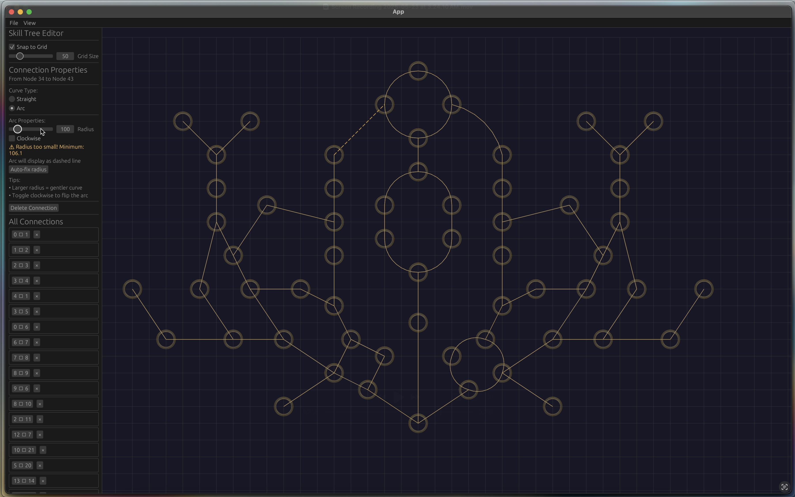

# Bevy Skill Tree Editor

This is a simple tool that allows you to create and edit skill trees for your game using Bevy. It provides a user-friendly interface for designing skill trees, adding skills, and defining their relationships. Skill trees are exported to RON files, which can be rendered anyway you like in your game.

## Features

- Create and edit skill trees visually
- Add skills and define their properties
- Define relationships between skills
- Import / Export skill trees to RON files
- Define straight or curved connections between skills

## Compatible Bevy versions

| Bevy version | Repo version |
|:-------------|:-------------|
| `0.16` | `main` |

## License

Licensed under either of

* MIT License ([LICENSE-MIT](LICENSE-MIT) or [http://opensource.org/licenses/MIT](http://opensource.org/licenses/MIT))
* Apache License, Version 2.0 ([LICENSE-APACHE](LICENSE-APACHE) or [http://www.apache.org/licenses/LICENSE-2.0](http://www.apache.org/licenses/LICENSE-2.0))

at your option.

Unless you explicitly state otherwise, any contribution intentionally submitted for inclusion in this repo by you, as defined in the Apache-2.0 license, shall be dually licensed as above, without any additional terms or conditions.
